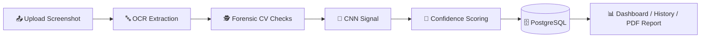

<div align="center">


### 🔍 AI-Powered Forensic Analysis for UPI Payment Screenshots
**OCR · Computer Vision · Explainable Confidence Scoring**

*A final-year B.Tech AI & ML project — detects edited/fake payment screenshots without ever touching real bank data.*

<br/>


<br/>

[](https://www.linkedin.com/in/anand-kumar-muppirisetty-884a59315)
[](mailto:anandkumar.muppirisetty@gmail.com)

</div>

<br/>

## 📖 Table of Contents

- [⚠️ Scope & Disclaimer](#️-scope--disclaimer)
- [✨ Features](#-features)
- [🖥️ Tech Stack](#️-tech-stack)
- [🏗️ Architecture](#️-architecture)
- [🚀 Quick Start](#-quick-start)
- [📁 Project Structure](#-project-structure)
- [📚 Documentation](#-documentation)
- [🔮 Future Scope](#-future-scope)
- [👨‍💻 Author](#-author)

---

## ⚠️ Scope & Disclaimer

> **This project does not verify real bank transactions.**

It performs **forensic image analysis** of an uploaded screenshot — OCR text
extraction plus classical computer-vision and CNN-based manipulation detection —
to produce an explainable confidence score describing how likely the **image**
is to have been digitally edited.

It never contacts a bank, UPI switch, or NPCI system, has no access to real
account/transaction data, and its verdict should not be treated as legal or
financial proof. Real transaction verification requires regulated institutional
API access — intentionally out of scope for this academic project.

---

## ✨ Features

<table>
<tr>
<td width="50%">

### 🏠 Landing Page
Hero section, feature cards, architecture diagram, About the AI, Future Scope

### 🔐 Authentication
Register, login, forgot/reset password — JWT access + refresh tokens

### 📊 Dashboard
Total analyses, suspicious/genuine counts, average confidence, pie chart, bar chart, timeline

### 📤 Smart Upload
Drag-and-drop PNG/JPG/JPEG with live preview

### 🔤 OCR Engine
Extracts amount, date, time, UTR, bank name, sender/receiver UPI ID, payment status

### 🕵️ AI Forensic Analysis
9 independent checks: font inconsistency, copy-paste artifacts, compression
artifacts, edited amount, fake QR, metadata anomalies, cropping, blur
inconsistency, + CNN signal

</td>
<td width="50%">

### 🎯 Confidence Score
0–100% score with a 3-tier verdict: **Likely Genuine** / **Needs Manual Review** / **Highly Suspicious**

### 💡 Explainability
Plain-language checklist of exactly *why* a screenshot was flagged

### 🕘 History
Search, sort, filter, delete past analyses

### 📄 Export Report
Downloadable PDF with screenshot, extracted text, findings, and score

### 🛡️ Admin Dashboard
User management, system-wide stats, audit logs

### 📚 API Docs
Auto-generated Swagger UI at `/api/docs`

</td>
</tr>
</table>

---

## 🖥️ Tech Stack

<div align="center">

| Layer | Technology |
|:---:|:---|
| **Frontend** | React · TypeScript · Tailwind CSS · Framer Motion · Recharts |
| **Backend** | Python · FastAPI · JWT Auth · SlowAPI Rate Limiting |
| **AI Pipeline** | EasyOCR / Tesseract · OpenCV · scikit-image · PyTorch (CNN) |
| **Database** | PostgreSQL · SQLAlchemy · Alembic |
| **Storage** | Local disk · UUID-named files |
| **DevOps** | Docker · Docker Compose |

</div>

---

## 🏗️ Architecture



Full diagrams: [Architecture](docs/diagrams/architecture.md) · [ER Diagram](docs/diagrams/er-diagram.md) · [Sequence Diagram](docs/diagrams/sequence-diagram.md)

---

## 🚀 Quick Start

```bash
git clone https://github.com/<your-username>/fake-payment-detector.git
cd fake-payment-detector
docker compose up --build
```

| Service | URL |
|---|---|
| 🌐 Frontend | http://localhost:5173 |
| ⚙️ Backend + Swagger Docs | http://localhost:8000/api/docs |

Create your first admin account:
```bash
docker compose exec backend python -m scripts.create_admin admin@example.com "Admin User" "StrongPass123!"
```

📖 Full setup guide (with or without Docker): [`docs/INSTALLATION.md`](docs/INSTALLATION.md)

---

## 📁 Project Structure


Claude finished the response
Assessing how visual the earlier readme actually looks.
Honest answer: it's moderately visual — it has:

✅ Colorful tech-stack badges (Python, FastAPI, React, etc.)
✅ Emojis as section markers
✅ Clean tables
✅ Centered title block
But it does NOT have:

❌ Actual screenshots of your app
❌ A banner/logo image
❌ GIFs or demo previews
Real "eye-catching" GitHub READMEs usually have actual screenshots of the working app, which makes a much bigger visual impact — especially for a project like yours where people would want to see the dashboard, upload screen, and confidence gauge in action.

Want me to make it more visual?
If you send me 2-4 screenshots of your app running (dashboard, upload result, landing page — whatever looks best), I can rebuild the README with:

A proper header banner
Screenshots embedded in the features section
A "Live Demo" style visual walkthrough
Like tools logos etc LinkedIn, Gmail

Designing a README with logo-style tech stack badges.
Got it — you want personal contact badges (like LinkedIn, Gmail icons) added too, common in developer READMEs. I can build that section, but I'll need your actual details to fill in (I won't make up links).

I mean professional and attractive grabbing attention readme like starting to ending no compromise and last like professional linkedln id: "https://www.linkedin.com/in/anand-kumar-muppirisetty-884a59315?utm_source=share_via&utm_content=profile&utm_medium=member_android".  Gmail: "anandkumar.muppirisetty@gmail.com"

Planning the full README structure and content sections.
Let's make this genuinely stand out — full professional treatment, badges with real logos, mermaid architecture diagram (renders live on GitHub), table of contents, and a polished contact section with your LinkedIn and Gmail.

Ran 2 commands
Here it is — full professional treatment with animated wave banners, real tech-logo badges, a table of contents, a live-rendering Mermaid architecture diagram, and your LinkedIn/Gmail contact section at the bottom.

How to publish it:
Go to github.com/YOUR-USERNAME/fake-payment-detector
Click on README.md → click the ✏️ pencil (Edit) icon
Ctrl + A, Delete
Paste everything below
Scroll down → Commit changes
Paste this entire block:
Ran a command
markdown
<div align="center">


### 🔍 AI-Powered Forensic Analysis for UPI Payment Screenshots
**OCR · Computer Vision · Explainable Confidence Scoring**

*A final-year B.Tech AI & ML project — detects edited/fake payment screenshots without ever touching real bank data.*

<br/>


<br/>

[](https://www.linkedin.com/in/anand-kumar-muppirisetty-884a59315)
[](mailto:anandkumar.muppirisetty@gmail.com)

</div>

<br/>

## 📖 Table of Contents

- [⚠️ Scope & Disclaimer](#️-scope--disclaimer)
- [✨ Features](#-features)
- [🖥️ Tech Stack](#️-tech-stack)
- [🏗️ Architecture](#️-architecture)
- [🚀 Quick Start](#-quick-start)
- [📁 Project Structure](#-project-structure)
- [📚 Documentation](#-documentation)
- [🔮 Future Scope](#-future-scope)
- [👨‍💻 Author](#-author)

---

## ⚠️ Scope & Disclaimer

> **This project does not verify real bank transactions.**

It performs **forensic image analysis** of an uploaded screenshot — OCR text
extraction plus classical computer-vision and CNN-based manipulation detection —
to produce an explainable confidence score describing how likely the **image**
is to have been digitally edited.

It never contacts a bank, UPI switch, or NPCI system, has no access to real
account/transaction data, and its verdict should not be treated as legal or
financial proof. Real transaction verification requires regulated institutional
API access — intentionally out of scope for this academic project.

---

## ✨ Features

<table>
<tr>
<td width="50%">

### 🏠 Landing Page
Hero section, feature cards, architecture diagram, About the AI, Future Scope

### 🔐 Authentication
Register, login, forgot/reset password — JWT access + refresh tokens

### 📊 Dashboard
Total analyses, suspicious/genuine counts, average confidence, pie chart, bar chart, timeline

### 📤 Smart Upload
Drag-and-drop PNG/JPG/JPEG with live preview

### 🔤 OCR Engine
Extracts amount, date, time, UTR, bank name, sender/receiver UPI ID, payment status

### 🕵️ AI Forensic Analysis
9 independent checks: font inconsistency, copy-paste artifacts, compression
artifacts, edited amount, fake QR, metadata anomalies, cropping, blur
inconsistency, + CNN signal

</td>
<td width="50%">

### 🎯 Confidence Score
0–100% score with a 3-tier verdict: **Likely Genuine** / **Needs Manual Review** / **Highly Suspicious**

### 💡 Explainability
Plain-language checklist of exactly *why* a screenshot was flagged

### 🕘 History
Search, sort, filter, delete past analyses

### 📄 Export Report
Downloadable PDF with screenshot, extracted text, findings, and score

### 🛡️ Admin Dashboard
User management, system-wide stats, audit logs

### 📚 API Docs
Auto-generated Swagger UI at `/api/docs`

</td>
</tr>
</table>

---

## 🖥️ Tech Stack

<div align="center">

| Layer | Technology |
|:---:|:---|
| **Frontend** | React · TypeScript · Tailwind CSS · Framer Motion · Recharts |
| **Backend** | Python · FastAPI · JWT Auth · SlowAPI Rate Limiting |
| **AI Pipeline** | EasyOCR / Tesseract · OpenCV · scikit-image · PyTorch (CNN) |
| **Database** | PostgreSQL · SQLAlchemy · Alembic |
| **Storage** | Local disk · UUID-named files |
| **DevOps** | Docker · Docker Compose |

</div>

---

## 🏗️ Architecture


Full diagrams: [Architecture](docs/diagrams/architecture.md) · [ER Diagram](docs/diagrams/er-diagram.md) · [Sequence Diagram](docs/diagrams/sequence-diagram.md)

---

## 🚀 Quick Start

```bash
git clone https://github.com/<your-username>/fake-payment-detector.git
cd fake-payment-detector
docker compose up --build
```

| Service | URL |
|---|---|
| 🌐 Frontend | http://localhost:5173 |
| ⚙️ Backend + Swagger Docs | http://localhost:8000/api/docs |

Create your first admin account:
```bash
docker compose exec backend python -m scripts.create_admin admin@example.com "Admin User" "StrongPass123!"
```

📖 Full setup guide (with or without Docker): [`docs/INSTALLATION.md`](docs/INSTALLATION.md)

---

## 📁 Project Structure
fake-payment-detector/
├── frontend/ ⚛️ React + TypeScript + Tailwind CSS SPA
├── backend/ 🚀 FastAPI REST API (auth, uploads, history, admin)
├── ai/ 🧠 OCR, forensic CV checks, CNN classifier, confidence scoring
├── database/ 🗄️ Alembic migrations (PostgreSQL schema)
├── docs/ 📚 Full documentation set
└── docker-compose.yml 🐳 One-command local stack


---

## 📚 Documentation

| Doc | Purpose |
|---|---|
| [`docs/README.md`](docs/README.md) | Full project overview & scope disclaimer |
| [`docs/INSTALLATION.md`](docs/INSTALLATION.md) | Local setup guide |
| [`docs/API_DOCUMENTATION.md`](docs/API_DOCUMENTATION.md) | REST API reference |
| [`docs/DEPLOYMENT.md`](docs/DEPLOYMENT.md) | Deployment guide |
| [`HOW_TO_RUN.md`](HOW_TO_RUN.md) | Quick day-to-day run instructions |

---

## 🔮 Future Scope

- 🏦 Official NPCI/bank-partner API integration for real settlement verification
- 🧠 Training the bundled CNN classifier on a labeled genuine/manipulated dataset (`ai/models/train.py`)
- 📱 On-device capture to reduce screenshot re-compression noise
- 🌐 Multi-language OCR support for regional payment apps
- 🧩 Browser extension / mobile app front-ends reusing the same backend API

---

## 👨‍💻 Author

<div align="center">

**Anand Kumar Muppirisetty**

[](https://www.linkedin.com/in/anand-kumar-muppirisetty-884a59315)
[](mailto:anandkumar.muppirisetty@gmail.com)

<br/>

⭐ **If you found this project interesting, consider giving it a star!** ⭐


</div>
