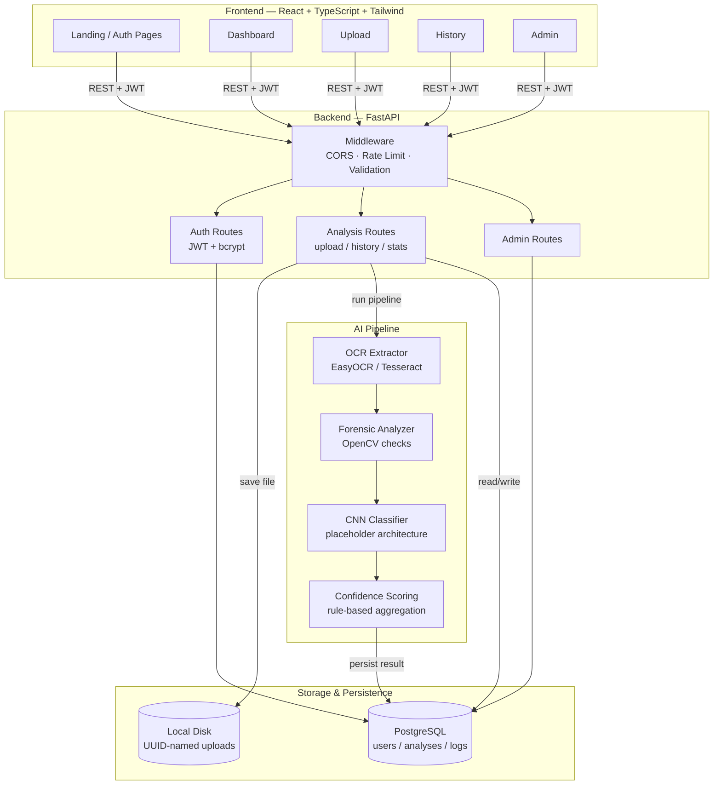

# System Architecture Diagram

## Layer responsibilities

- **Frontend** — SPA rendering all 14 feature areas; talks to the backend
  exclusively via the versioned REST API (`/api/v1`).
- **Backend** — FastAPI app handling auth, request validation, rate
  limiting, and orchestration; contains no AI logic itself, only calls into
  the `ai/` package.
- **AI Pipeline** — pure Python package (`ai/`), independent of FastAPI, so
  it can be unit-tested or reused (e.g. in a batch job) without spinning up
  the API.
- **Storage** — uploaded screenshots on local disk under UUID filenames;
  structured results, users, and audit logs in PostgreSQL.
