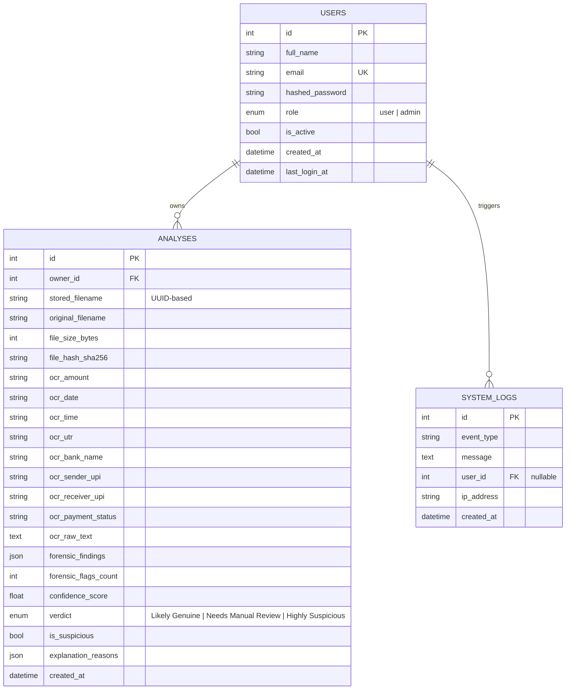

# Database ER Diagram

## Notes

- `analyses.forensic_findings` and `analyses.explanation_reasons` are
  stored as `JSON` columns rather than normalized child tables — each
  analysis owns a small, fixed-shape list that is always read/written
  together with its parent row, so JSON keeps the schema simple without
  sacrificing queryability of the top-level fields (`confidence_score`,
  `verdict`, etc.) used for dashboard aggregation.
- `file_hash_sha256` is indexed to support future de-duplication /
  integrity-check features.
- `system_logs.user_id` is nullable to allow logging pre-auth events (e.g.
  failed login attempts against an email with no matching account).
