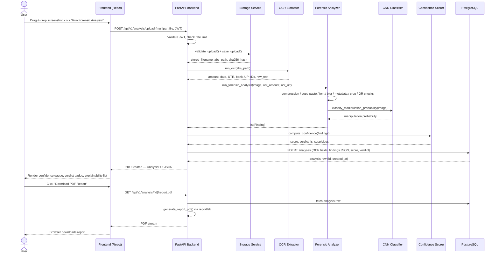

# Sequence Diagram — Screenshot Upload & Analysis

```mermaid
sequenceDiagram
    actor User
    participant FE as Frontend (React)
    participant API as FastAPI Backend
    participant ST as Storage Service
    participant OCR as OCR Extractor
    participant FOR as Forensic Analyzer
    participant CNN as CNN Classifier
    participant CONF as Confidence Scorer
    participant DB as PostgreSQL

    User->>FE: Drag & drop screenshot, click "Run Forensic Analysis"
    FE->>API: POST /api/v1/analysis/upload (multipart file, JWT)
    API->>API: Validate JWT, check rate limit
    API->>ST: validate_upload() + save_upload()
    ST-->>API: stored_filename, abs_path, sha256_hash

    API->>OCR: run_ocr(abs_path)
    OCR-->>API: amount, date, UTR, bank, UPI IDs, raw_text

    API->>FOR: run_forensic_analysis(image, ocr_amount, ocr_utr)
    FOR->>FOR: compression / copy-paste / font / blur / metadata / crop / QR checks
    FOR->>CNN: classify_manipulation_probability(image)
    CNN-->>FOR: manipulation probability
    FOR-->>API: list[Finding]

    API->>CONF: compute_confidence(findings)
    CONF-->>API: score, verdict, is_suspicious

    API->>DB: INSERT analyses (OCR fields, findings JSON, score, verdict)
    DB-->>API: analysis row (id, created_at)

    API-->>FE: 201 Created — AnalysisOut JSON
    FE-->>User: Render confidence gauge, verdict badge, explainability list

    User->>FE: Click "Download PDF Report"
    FE->>API: GET /api/v1/analysis/{id}/report.pdf
    API->>DB: fetch analysis row
    API->>API: generate_report_pdf() via reportlab
    API-->>FE: PDF stream
    FE-->>User: Browser downloads report
```
